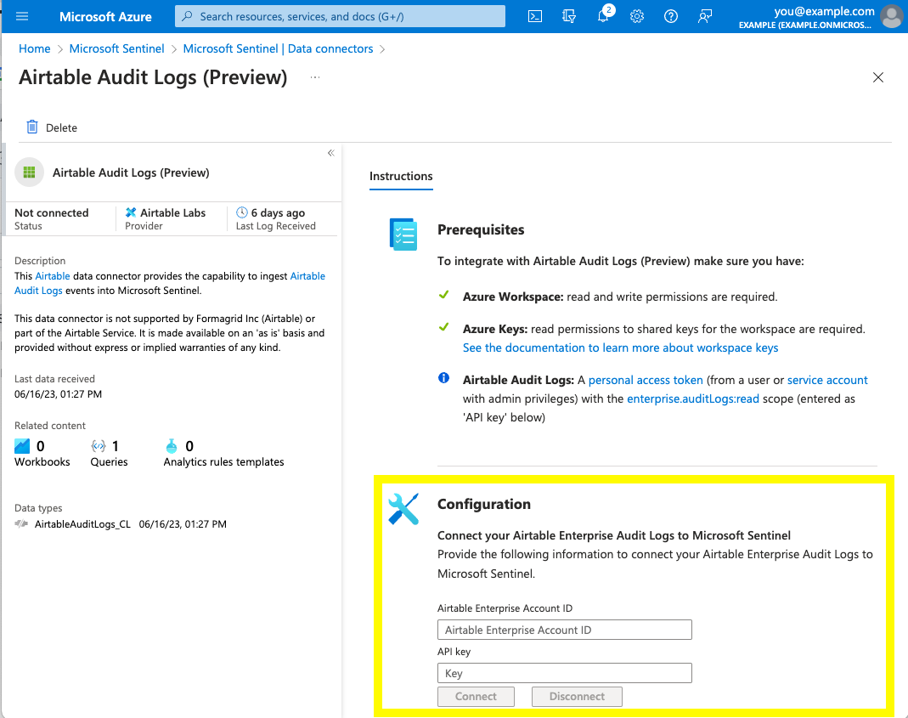

# Azure Sentinel Connector for Airtable Audit Logs

This repository contains an example Microsoft Sentinel codeless connector ([`Azure_Sentinel_Codeless_Connector.json`](./Azure_Sentinel_Codeless_Connector.json)) to help you continuously ingest [Airtable Audit Logs](https://airtable.com/developers/web/api/audit-logs-overview) into the [Microsoft Sentinel](https://azure.microsoft.com/en-us/products/microsoft-sentinel/) ecosystem without the needing to write code or host additional infrastructure.

---

The software made available from this repository is not supported by Formagrid Inc (Airtable) or part of the Airtable Service. It is made available on an "as is" basis and provided without express or implied warranties of any kind.

---

### Overview of Sentinel Codeless Connectors

Microsoft Sentinel has [several options for creating custom connectors](https://learn.microsoft.com/en-us/azure/sentinel/create-custom-connector). Codeless Connectors are "best for less technical audiences to create SaaS connectors using a configuration file instead of advanced development." and have the benefit of not requiring any infrastructure: Microsoft Sentinel will use the configuration to poll the specified API for you.

While codeless connectors do not have code, the configuration is in JSON format and requires familiarity with HTTP-based APIs and pagination. The example file in this repository is preconfigured to work with Airtable's Audit Logs API based on [Microsoft's instructions on how to create a codeless connector](https://learn.microsoft.com/en-us/azure/sentinel/create-codeless-connector). 

### About this Codeless Connector for Airtable Audit Logs

The codeless connector example in this repository, [`Azure_Sentinel_Codeless_Connector.json`](./Azure_Sentinel_Codeless_Connector.json), is configured to:
- Poll the [Airtable Audit Logs event retrieval endpoint](https://airtable.com/developers/web/api/audit-log-events) every 5 minutes and request up to 100 events per page. If there is another page of results available, the connector will automatically retrieve the next page of events.
- Retrieve events across all event types (you can find a list with their definitions [here](https://airtable.com/developers/web/api/audit-log-event-types)). When Airtable adds new event types to the list, they will automatically be included.
- Add audit log events from Airtable to the `AirtableAuditLogs_CL` table. If the table does not yet exist, the codeless connector will create it. 

### Setup / deploy

To setup this codeless connector in your Azure environment, follow [Microsoft's deployment steps](https://learn.microsoft.com/en-us/azure/sentinel/create-codeless-connector?tabs=deploy-via-arm-template%2Cconnect-via-the-azure-portal#deploy-your-connector-in-microsoft-sentinel-and-start-ingesting-data) with the following guidance:
- For step 1: Use [`Azure_Sentinel_Codeless_Connector.json`](./Azure_Sentinel_Codeless_Connector.json) as the custom ARM template for your custom deployment in the Azure console.
- For step 2: The configuration wizard will ask you for your Airtable Enterprise Account ID and API key (screenshot below). 
  - Airtable Enterprise Account ID: This ID starts with the letters "ent" and can be found in the left-hand sidebar of your Enterprise Admin console.
  - API key: We recommended you use a personal access token belonging to a [service account](https://support.airtable.com/docs/en/service-accounts-overview). The service account will need to be made an admin for your enterprise account and the personal access token will need to have the [`enterprise.auditLogs:read`](https://airtable.com/developers/web/api/scopes#enterprise-audit-logs-read) scope.
- For step 3: In testing, we have found it takes 20 to 30 minutes for an Azure codeless connector to begin retrieving logs. After this period, you should see a new `AirtableAuditLogs_CL` table in your Sentinel log explorer.

#### Configuration screenshot (step 2)

